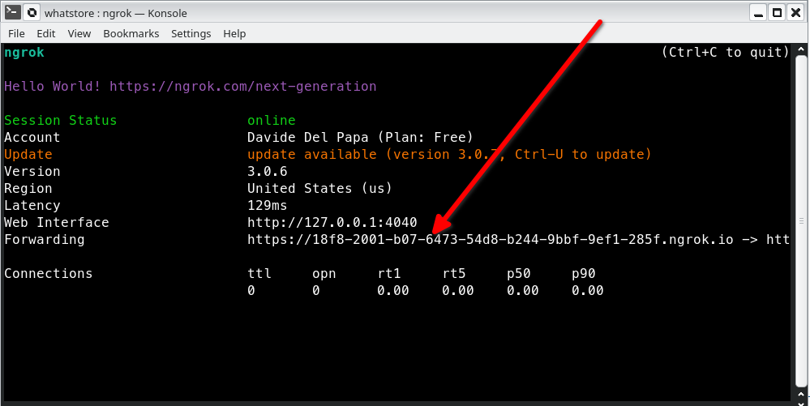

# Whatstore

Whatsapp Business app to implement a chat-based e-commerce store


## How it works

### How the data is stored:

Data is stored as JSON objects with the RedisJSON module.

* The e-commerce data is stored in various keys. 
    * A `store:info` key holds all the info related to the store
    * `product:*` keys hold data for the products
    * `category:*` keys hold data for the products' categories
    * `user:*` keys hold information about the user-sessions, like the cart
    * `purchase:*` keys hold information about completed purchases

### How the data is accessed:

* Store info: 
  * Get store info: `JSON.GET store:info $`
  * Set store info: `JSON.SET store:info $ {store-info-objec}`
* Product info: 
  * Get product info: `JSON.GET product:{product-id} $`
  * Set product info: `JSON.SET product:{product-id} $ {product-info-objec}`
* Product category info: 
  * Get category info: `JSON.GET category:{category-id} $`
  * Set category info: `JSON.SET category:{category-id} $  {category-info-objec}`
  * Get all categories: `KEYS category:*`
* User information:
  * Get user info: `JSON.GET user:{user-phone-number} $`
  * Set user info: `JSON.SET user:{user-phone-number} $  {user-info-objec}`
  * Get user's cart info: `JSON.GET user:{user-phone-number} $.cart`
  * Set user's cart info: `JSON.SET user:{user-phone-number} $.cart  {user-cart-info-objec}`
  * Empty cart: `JSON.SET user:{user-phone-number} $.cart  "[]"`
* Purchase information:
  * Set user info: `JSON.SET purchase:{year}_{uuid.v4} $  {purchase-info-objec}`
* Pending orders information:
  * Get pending orders info: `JSON.GET pending_orders $`
  * Set pending orders info: `JSON.SET pending_orders $  {pending-orders-info-objec}`

## How to run it locally?

### Prerequisites

* Node - v16.17.0
* NPM - v8.15.0
* NODEMON - v2.0.19
* [NGROK](https://ngrok.com) (or similar).

### Local installation

Download the repo.

```sh
git clone https://github.com/davidedelpapa/whatstore.git
cd whatstore
```

Rename the *sample.env.js* and store there your credentials for RedisHub and Whatsapp Business.

```sh
cp sample.env.js env.js
```

If you don't have the needed credentials, read the following section.

#### Filling in credentials for env.js

If you don't have a Redis account, you need to create free account in [https://redislabs.com/try-free/](https://redislabs.com/try-free/)

* Choose your preferred cloud vendor. Select the region and then click "Let's start free" to create your free database automatically.


* You will be provided with Public endpoint URL and "Redis Stack" as the type of database with the list of modules that comes by default.


* You need to take note of the following, and save them in the *env.js* variables
  * REDIS_HOST: get it from *Public endpoint*
  * REDIS_PORT: get it from *Public endpoint*

Then go to *Data Access Control*, tab *Roles* and add a new role:


* Select a name, your Database, and in *Redis acls* select *Full-Acess*.
* Then add a new User, selecting the user-name, password, and the role we just created.
* Now you can fill in the following in the *env.js*:
  * REDIS_USER: the user-name you just selected
  * REDIS_PASSWORD: the password you just selected

Now, for the Whatsapp Business part, you need a valid Meta developer account. If you don’t, please sign in at [https://developers.facebook.com/](https://developers.facebook.com/)

* Log in with your Meta developer account
* Point your browser to [https://developers.facebook.com/apps](https://developers.facebook.com/apps)
* Click **Create app** (green button)
* In the screen that follows, select the app type **Business**


* In the following page, select your app name and your email address, then the website or business that you want to associate with the app
* Then you will have the possibility to add a Meta Products to your app:


* select **WhatsApp** and click **Set up** button.
* Then you will be shown the page "first steps" for the whatsapp product


* Add a new **Test phone number** and annotate both the phone number and its ID
* Annotate also the **WhatsApp Business Account ID** and the temp. **Access Token**

* You need to take note of the following, and save them in the *env.js* variables
  * WA_ACCESS_TOKEN
  * WA_SENDER_PHONENUMBER_ID
  * WA_BUSINESS_APP_ID

* Then, you need to add also a phone number where whatsapp is active (yousually your own number) that you will use as a test that will act as the buyer. Plus, if you own it, another phone number that will be act as the seller. If you have just one phone number available, don't worry, you will be able to thest this app anyway.
* You can add up to 5 numbers for each Whatsapp App, if you want to, and you will need to verify ownership of each of them.

* You need to save in the *env.js* also the phone number that will act as the seller, in the `SELLER_PHONE` variable. If you have just one number available, save that one.

The last thing you need to fill in for *env.js* is `WA_VERIFY_TOKEN`: you can generate this as you wish, or write a secret string, such as `'verifyThisToken'`. You will need this later on.

#### Set-up and run the app

Once the *env.js* is filled in, you can run the app. 

* First, you need to run the *setup.js* script, that will load the Redis database with a mock store information

```sh
npm update
node setup.js
```

* Now you can run the app:

```sh
npm start
```

> **Note**: If you have just one phone number to test the app, that will act as both buyer and seller, you need to start the app with the `ONE_PHONE` flag on, that is: `ONE_PHONE=ON npm start`

* In a separate shell you will need to run *ngrok* as well:

```sh
ngrok http  --region us 9000
```

Beware to set the `us` region, as whatsapp business does not play well with every region.

* Now take note of the *forwarding* as you need to add it to the whatsapp app



* Go to the configuration page of the whatsapp app


* Configure the callback url
  * Add the ngrok forwarding url, adding at the end `"/whatsapp/callbackurl"`, for example: `"https://18f8-2001-b07-6473.ngrok.io/whatsapp/callbackurl"`
  * Add below it the `WA_VERIFY_TOKEN` you generated in the *env.js*
  * Press **Verify and save**; if that succeed, you will see in your console the node app log: "Callback URL Verified"

* Now configure the webhooks just below the callback url


* Just select the `messages` and **save**

Your app is ready to work!

## App USage

* First you need to ping the business number from you number, it does not matter what you write. It will answer with a choice to either view the products or to spek to a human.


* If you choose "Speak to a human" it sends a vCard for the customer care contact; otherwise the app will present to you the product categories choice.


* Now you can choose a category and then be presented with a choice of products in that category.


* Here we selected the classic pizzas, and now we are going to select a "Salame(Pepperoni)"
* We are presented with the details of our selection, and we can now choose to eother add the product to the cart or browse for some more products. Let's add it to the cart.
  


* We can now review the cart, before checking out, or browse some more products to add. Let's review and checkout!


* We can also modify the cart before checkout


* After checking out, the app notifies the seller of a new incoming order, and presents to the buyer some options to either again talk to a human or browse more products to shop.

We have accomplished our purchase!

* On the seller side, the seller number gets notified of the incoming order with all the info needed to prepare the order. The seller has the possibility  to send the seller a notification of when the order will be reay, or fulfill the order right away. Finally the seller can review also all pending orders.


* At any time the seller can ping their app to check how many ending order are present and view each of them (this is not available when the app is started with just one phone).
* Finally, when the order is fullfilled, the app saves the purchased order to the database as a purchase order. This could be used for statistics.

## Deployment

To make deploys work, you need to create free account in https://redislabs.com/try-free/

## More Information about Redis Stack

Here some resources to help you quickly get started using Redis Stack. If you still have questions, feel free to ask them in the [Redis Discord](https://discord.gg/redis) or on [Twitter](https://twitter.com/redisinc).

### Getting Started

1. Sign up for a [free Redis Cloud account using this link](https://redis.info/try-free-dev-to) and use the [Redis Stack database in the cloud](https://developer.redis.com/create/rediscloud).
1. Based on the language/framework you want to use, you will find the following client libraries:
    - [Redis OM .NET (C#)](https://github.com/redis/redis-om-dotnet)
        - Watch this [getting started video](https://www.youtube.com/watch?v=ZHPXKrJCYNA)
        - Follow this [getting started guide](https://redis.io/docs/stack/get-started/tutorials/stack-dotnet/)
    - [Redis OM Node (JS)](https://github.com/redis/redis-om-node)
        - Watch this [getting started video](https://www.youtube.com/watch?v=KUfufrwpBkM)
        - Follow this [getting started guide](https://redis.io/docs/stack/get-started/tutorials/stack-node/)
    - [Redis OM Python](https://github.com/redis/redis-om-python)
        - Watch this [getting started video](https://www.youtube.com/watch?v=PPT1FElAS84)
        - Follow this [getting started guide](https://redis.io/docs/stack/get-started/tutorials/stack-python/)
    - [Redis OM Spring (Java)](https://github.com/redis/redis-om-spring)
        - Watch this [getting started video](https://www.youtube.com/watch?v=YhQX8pHy3hk)
        - Follow this [getting started guide](https://redis.io/docs/stack/get-started/tutorials/stack-spring/)

The above videos and guides should be enough to get you started in your desired language/framework. From there you can expand and develop your app. Use the resources below to help guide you further:

1. [Developer Hub](https://redis.info/devhub) - The main developer page for Redis, where you can find information on building using Redis with sample projects, guides, and tutorials.
1. [Redis Stack getting started page](https://redis.io/docs/stack/) - Lists all the Redis Stack features. From there you can find relevant docs and tutorials for all the capabilities of Redis Stack.
1. [Redis Rediscover](https://redis.com/rediscover/) - Provides use-cases for Redis as well as real-world examples and educational material
1. [RedisInsight - Desktop GUI tool](https://redis.info/redisinsight) - Use this to connect to Redis to visually see the data. It also has a CLI inside it that lets you send Redis CLI commands. It also has a profiler so you can see commands that are run on your Redis instance in real-time
1. Youtube Videos
    - [Official Redis Youtube channel](https://redis.info/youtube)
    - [Redis Stack videos](https://www.youtube.com/watch?v=LaiQFZ5bXaM&list=PL83Wfqi-zYZFIQyTMUU6X7rPW2kVV-Ppb) - Help you get started modeling data, using Redis OM, and exploring Redis Stack
    - [Redis Stack Real-Time Stock App](https://www.youtube.com/watch?v=mUNFvyrsl8Q) from Ahmad Bazzi
    - [Build a Fullstack Next.js app](https://www.youtube.com/watch?v=DOIWQddRD5M) with Fireship.io
    - [Microservices with Redis Course](https://www.youtube.com/watch?v=Cy9fAvsXGZA) by Scalable Scripts on freeCodeCamp
